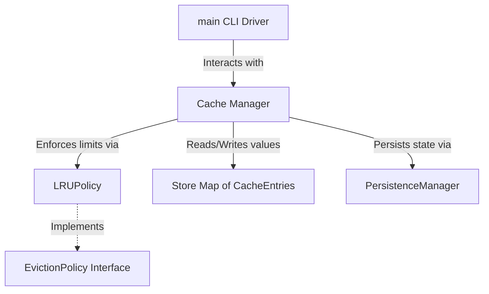

# Redite 🚀

A lightweight, high-performance, in-memory key-value database written in C++17. Designed as a minimal, portfolio-quality clone of Redis to demonstrate clean C++ architecture, data structures, and algorithms.

## Features

- 🏎️ **O(1) LRU Eviction**: Doubly-linked list + hash map register handles cache pruning in constant time.
- ⏳ **Lazy Expiration (TTL)**: Supports per-key Time-to-Live settings. Stale keys are lazily detected and cleared on access.
- 💾 **Data Persistence**: Human-readable CSV snapshot engine parses database state to disk on termination and restores it at startup.
- 🐚 **Interactive Command Line**: A built-in CLI loop supports `SET`, `GET`, `DEL`, and `EXIT` operations.
- 📦 **Zero External Dependencies**: Pure C++ Standard Library code.

---

## Codebase Architecture



- **[CacheEntry.h](CacheEntry.h)**: Representation of a database item containing keys, values, insertion time, and relative expiration time points.
- **[EvictionPolicy.h](EvictionPolicy.h)**: Base eviction interface alongside the `LRUPolicy` implementation.
- **[Cache.cpp](Cache.cpp)**: Primary engine coordinator containing cache operational logic.
- **[PersistenceManager.cpp](PersistenceManager.cpp)**: Handles string-escaping, parsing, and serialization mechanics to snapshot CSV files.

---

## Getting Started

### Prerequisites

You need a C++17 compliant compiler (such as `g++`, `clang++`, or `MSVC`).

### Compile

Compile using any standard C++ compiler:

```bash
g++ -std=c++17 -Wall -Wextra -o redite main.cpp Cache.cpp PersistenceManager.cpp
```

### Run

```bash
./redite
```

### CLI Command List

*   `SET <key> <value> [ttl_in_seconds]` — Insert or overwrite a key with an optional TTL.
*   `GET <key>` — Retrieve a value (triggers lazy TTL expiration if key is stale).
*   `DEL <key>` — Delete a key-value pair.
*   `EXIT` — Save the database snapshot to disk and terminate.
